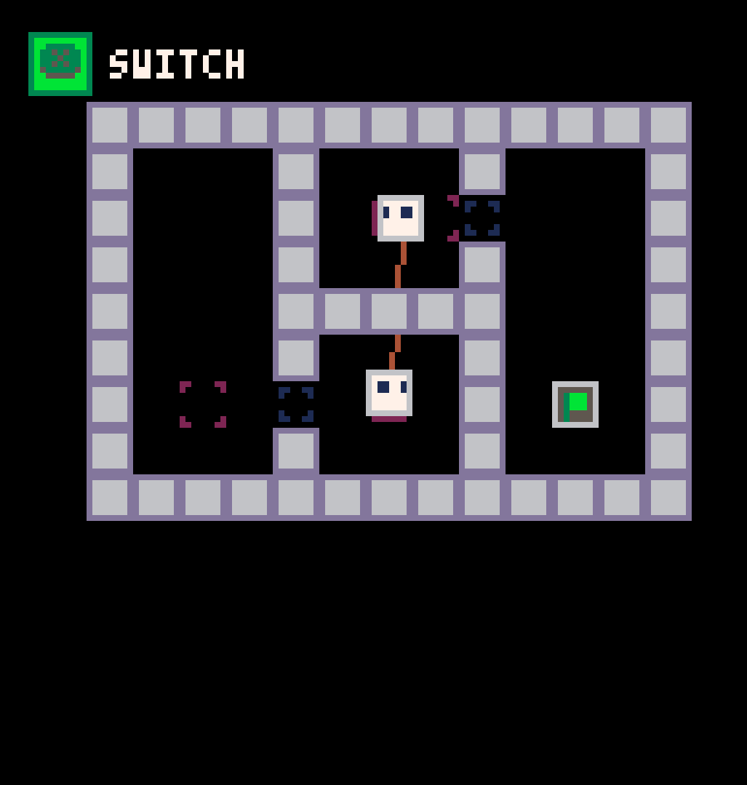
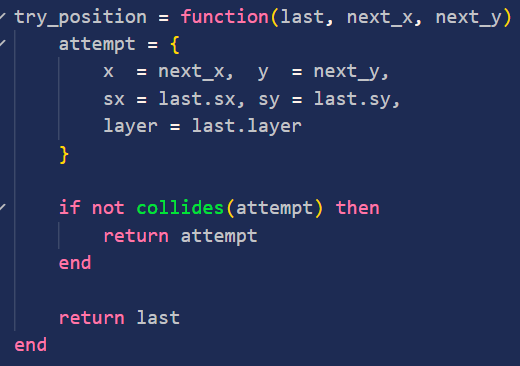
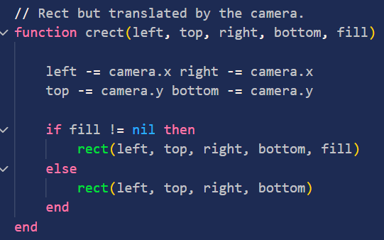
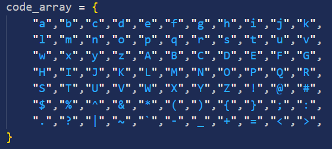
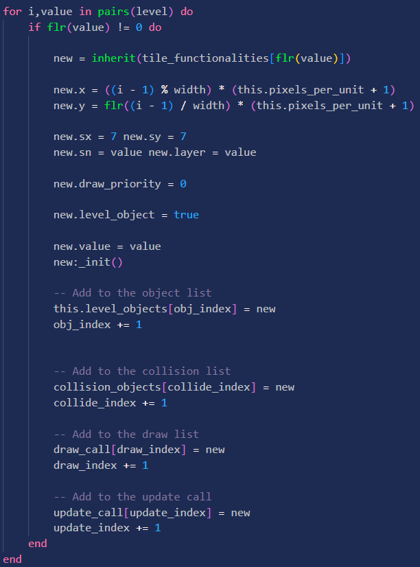
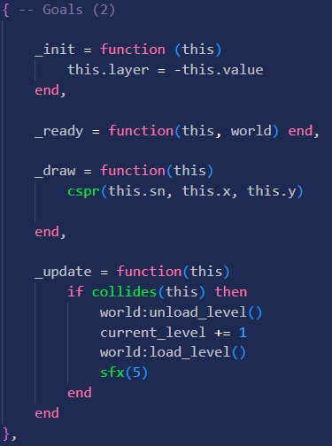

# Picomitter
Made for Hackclub's Dummies V2

A short top-down puzzle game where you switch between two robots.

## Learning Methods
- Everything used to make this project was learned from a couple sources
    - PICO documentation, like [nerdyteachers.com](https://nerdyteachers.com/PICO-8/Guide/).
    - Looking up Lua-specific syntax.
        - I got stuck on how Lua's arrays are [1,2,3] not [0,1,2] multiple times...
    - Messing around within the projects themselves to figure things out.
- I also applied knowledge from earlier experiences, like the physics engine is somewhat based on ones I made a long time ago on KhanAcademy, albeit *much, much* better.

## Project Overview
### Physics
- Completely handmade [physics engine](collision.lua)
- I'm pretty sure there's shortcuts, but I had a lot of fun designing my own collision detection and stopping from scratch for this
- 
- Whenever the players try to move, they run this function, which only returns where they're trying to move if that position doesn't collide with any of the tiles
### Camera
- The [camera](camera.lua) is effectively just an offset on everything drawn to the screen, that follows the player. It wraps all the draw functions and offsets them.
-  
- ^One of the wrapped functions
### Encoding
- Levels are stored as strings, for example the first level is "10a00310100810100310100151100421100110100310100810100310a00>00>101521d"
- Values above 9 are checked against a dictionary of every character on my keyboard and back for decoding, so it's very difficult to overflow.
    - For example, 10 is stored as "a"
     
- Each string is divided into sets of 3, where each bit is the value of the tile, its id (for things like doors and buttons), and how many of them there are in a row.
- Storing the amount in a row lets a long line of walls be stored as just "1, 0, amount" instead of "1, 0, 1, 0, 1, 0 ..." - lossless compression!
- These are encoded from the level editor, and decoded when the level is loaded from a level bank in [world.lua](world.lua)
- Finally, the last character of the string stores the size of the level, which is both the width and the height.
    - For example, the string mentioned earlier has a final character "d", or 13x13.
### Levels & Tiles
- Levels themselves just store a series of tiles in an array, and load that array like it's 2D with the width value.
- When loading a level, these tiles are loaded one by one into arrays used for collision, drawing, updating, and keeping track of the level's contents;
 -  
 - Each tile's functionality is stored in a huge table of tables that have their functions; (Ex, the goal table)
 -  
 - The index of these tables in the array matches their tile value, ie the Goal is in the 2nd indice.
